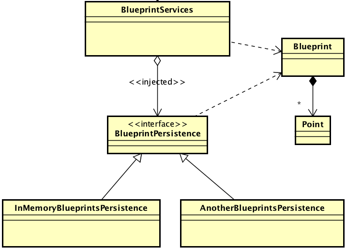

## Escuela Colombiana de Ingeniería
## Arquitecturas de Software

----
### Integrantes
- Sergio Andrés Bejarano Rodríguez
- Laura Daniela Rodríguez Sánchez
---

# Componentes y conectores - Parte I.

El ejercicio se debe traer terminado para el siguiente laboratorio (Parte II).

### Middleware- gestión de planos.

---
#### Antes de hacer este ejercicio, realice [el ejercicio introductorio al manejo de Spring y la configuración basada en anotaciones](https://github.com/ARSW-ECI/Spring_LightweightCont_Annotation-DI_Example).

Se realiza el ejercicio propuesto en el siguiente repositorio:
```
https://github.com/LauraRo166/Taller_IntroductorioManejoSpring
```

---

En este ejercicio se va a construir un modelo de clases para la capa lógica de una aplicación que permita gestionar planos arquitectónicos de una prestigiosa compañia de diseño. 



*1. Configure la aplicación para que funcione bajo un esquema de inyección de dependencias, tal como se muestra en el diagrama anterior.*
	Lo anterior requiere:

* *Agregar las dependencias de Spring:*
Veificamos en el pom tener las siguientes dependencias:

```
        <dependency>
            <groupId>org.springframework</groupId>
            <artifactId>spring-core</artifactId>
            <version>4.2.4.RELEASE</version>
        </dependency>
        <dependency>
            <groupId>org.springframework</groupId>
            <artifactId>spring-context</artifactId>
            <version>4.2.4.RELEASE</version>
        </dependency>
```

* *Agregar la configuración de Spring.*

Para agregar la configuración de Spring creamos el archivo `applicationContext.xml`, donde
habilitamos `context:component-scan` para que Spring busque en el paquete `edu.eci.arsw.blueprints`
las clases anotadas como `@Component`, `@Service`, `@Repository` y `@Controller`.

```xml
<?xml version="1.0" encoding="UTF-8"?>
<beans xmlns="http://www.springframework.org/schema/beans"
       xmlns:xsi="http://www.w3.org/2001/XMLSchema-instance"
       xmlns:context="http://www.springframework.org/schema/context"

       xsi:schemaLocation="http://www.springframework.org/schema/beans http://www.springframework.org/schema/beans/spring-beans-4.2.xsd
          http://www.springframework.org/schema/context http://www.springframework.org/schema/context/spring-context-4.2.xsd
">

    <context:component-scan base-package="edu.eci.arsw.blueprints" />
    
</beans> 
```
* *Configurar la aplicación -mediante anotaciones- para que el esquema de persistencia sea inyectado al momento de ser creado el bean 'BlueprintServices'.*

En la clase `BlueprintServices` deben ir las siguientes anotaciones:

```java
@Service
public class BlueprintsServices {

    @Autowired
    BlueprintsPersistence bpp = null;
}
```

y en la clase `InMemoryBlueprintPersistence` va la siguiente anotación:

```java
@Service
public class InMemoryBlueprintPersistence implements BlueprintsPersistence {
}
```

*2. Complete los operaciones getBluePrint() y getBlueprintsByAuthor(). Implemente todo lo requerido de las capas inferiores (por ahora, el esquema de persistencia disponible 'InMemoryBlueprintPersistence') agregando las pruebas correspondientes en 'InMemoryPersistenceTest'.*

Empezamos implementando los métodos en la clase `BlueprintsServices`.
```java
    /**
     * 
     * @param author blueprint's author
     * @param name blueprint's name
     * @return the blueprint of the given name created by the given author
     * @throws BlueprintNotFoundException if there is no such blueprint
     */
    public Blueprint getBlueprint(String author,String name) throws BlueprintNotFoundException{
        Blueprint blueprint=bpp.getBlueprint(author,name);
        if(blueprint==null){
            throw new BlueprintNotFoundException("Blueprint not found");
        }
        return blueprint;
    }
    
    /**
     * 
     * @param author blueprint's author
     * @return all the blueprints of the given author
     * @throws BlueprintNotFoundException if the given author doesn't exist
     */
    public Set<Blueprint> getBlueprintsByAuthor(String author) throws BlueprintNotFoundException{
        Set<Blueprint> blueprints=bpp.getBlueprintsByAuthor(author);
        if(blueprints==null || blueprints.isEmpty()){
            throw new BlueprintNotFoundException("Blueprints not found by author");
        }
        return blueprints;
    }
```
Ahora en `BlueprintsPersistence` verificamos que se encuentra el método `getBlueprint` y 
agregamos el método `getBlueprintsByAuthor`.

```java
    public Blueprint getBlueprint(String author, String bprintname) throws BlueprintNotFoundException;

    public Set<Blueprint> getBlueprintsByAuthor(String author) throws BlueprintNotFoundException;
```

Para terminar la implementación, implementamos el método `getBlueprintsByAuthor` en la clase `InMemoryBlueprintPersistence`.

```java
   @Override
    public Blueprint getBlueprint(String author, String bprintname) throws BlueprintNotFoundException {
        Blueprint blueprint=blueprints.get(new Tuple<>(author,bprintname));
        if (blueprint == null){
            throw new BlueprintNotFoundException("The blueprint does not exist");
        }
    
        return blueprint;
    }    
    
    @Override
    public Set<Blueprint> getBlueprintsByAuthor(String author) throws BlueprintNotFoundException {
        Set<Blueprint> result = new HashSet<>();

        for (Tuple<String, String> key : blueprints.keySet()) {
            if (key.getElem1().equals(author)) {
                result.add(blueprints.get(key));
            }
        }

        if (result.isEmpty()) {
            throw new BlueprintNotFoundException("No blueprints found for the author: " + author);
        }

        return result;
    }
```

Por último, realizamos los test en `InMemoryPersistenceTest` para los métodos implementados.

```java
@Test
    public void getBlueprintsByAuthorTest() throws BlueprintPersistenceException, BlueprintNotFoundException {
        InMemoryBlueprintPersistence ibpp = new InMemoryBlueprintPersistence();

        Point[] pts = new Point[]{new Point(10, 10), new Point(20, 20)};
        Blueprint bp1 = new Blueprint("alice", "blueprint1", pts);
        Blueprint bp2 = new Blueprint("alice", "blueprint2", pts);

        ibpp.saveBlueprint(bp1);
        ibpp.saveBlueprint(bp2);

        Set<Blueprint> blueprints = ibpp.getBlueprintsByAuthor("alice");
        assertEquals(2, blueprints.size());
    }

    @Test(expected = BlueprintNotFoundException.class)
    public void getBlueprintsByNonexistentAuthorTest() throws BlueprintNotFoundException {
        InMemoryBlueprintPersistence ibpp = new InMemoryBlueprintPersistence();
        ibpp.getBlueprintsByAuthor("nonexistent_author");
    }

    @Test
    public void getBlueprintTest() throws BlueprintPersistenceException, BlueprintNotFoundException {
        InMemoryBlueprintPersistence ibpp = new InMemoryBlueprintPersistence();

        Point[] pts = new Point[]{new Point(0, 0), new Point(40, 40)};
        Blueprint bp = new Blueprint("bob", "house", pts);
        ibpp.saveBlueprint(bp);

        Blueprint found = ibpp.getBlueprint("bob", "house");

        assertNotNull(found);
        assertEquals("bob", found.getAuthor());
        assertEquals("house", found.getName());
    }

    @Test(expected = BlueprintNotFoundException.class)
    public void getNonexistentBlueprintTest() throws BlueprintNotFoundException {
        InMemoryBlueprintPersistence ibpp = new InMemoryBlueprintPersistence();
        ibpp.getBlueprint("bob", "does_not_exist");
    }
```

De los test implementados se obtiene el siguiente resultado:

{Imagen resultado test}


*3. Haga un programa en el que cree (mediante Spring) una instancia de BlueprintServices, y rectifique la funcionalidad del mismo: registrar planos, consultar planos, registrar planos específicos, etc.*

*4. Se quiere que las operaciones de consulta de planos realicen un proceso de filtrado, antes de retornar los planos consultados. Dichos filtros lo que buscan es reducir el tamaño de los planos, removiendo datos redundantes o simplemente submuestrando, antes de retornarlos. Ajuste la aplicación (agregando las abstracciones e implementaciones que considere) para que a la clase BlueprintServices se le inyecte uno de dos posibles 'filtros' (o eventuales futuros filtros). No se contempla el uso de más de uno a la vez:*
	
* *(A) Filtrado de redundancias: suprime del plano los puntos consecutivos que sean repetidos.*

* *(B) Filtrado de submuestreo: suprime 1 de cada 2 puntos del plano, de manera intercalada.*

*5. Agrege las pruebas correspondientes a cada uno de estos filtros, y pruebe su funcionamiento en el programa de prueba, comprobando que sólo cambiando la posición de las anotaciones -sin cambiar nada más-, el programa retorne los planos filtrados de la manera (A) o de la manera (B).* 
